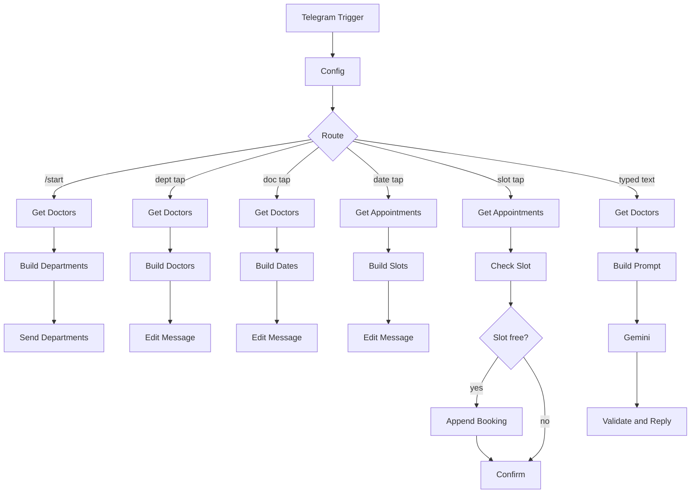

# Hospital Appointment Booking Bot (Telegram + n8n)

A Telegram bot that lets patients book appointments with doctors across multiple hospital departments. Patients can tap through menus or simply type what they need, and an AI model routes them to the right department. Live availability, double-booking protection and all booking data are handled by an n8n workflow backed by Google Sheets.

> This is a portfolio project built around a **simulated hospital**. All doctors, departments and data are fictional, and no real patient data is used.

---

## The Problem

In a multi-department hospital, booking is slow and confusing:

- Patients don't know which departments or doctors exist, or when each doctor is available.
- Staff check schedules by hand and reply to every request one by one.
- Two patients can be given the same slot, and requests sent outside working hours wait until the next day.
- Many patients don't know which department to choose for their problem.

## The Solution

A Telegram bot that works like a self-service reception desk:

1. The patient sends `/start` and sees the **departments**.
2. They pick a department and see its **doctors**, with the days each one works.
3. They pick a doctor and see the **next available dates**.
4. They pick a date and see only the **free time slots**.
5. They tap a slot and receive a **booking confirmation** with a booking ID.

Patients who don't know which department they need can **type a message** such as "I have a skin rash". An AI model suggests the right department from the real department list, and the patient continues with one tap.

## Features

- **Data-driven menus.** Departments, doctors, working days, hours and slot lengths are read live from a Google Sheet. Adding a doctor means adding one row. The workflow does not change.
- **Live availability.** Free slots are generated from each doctor's schedule, and slots that are already booked are removed.
- **Double-booking protection.** The slot is checked again immediately before saving, so a stale button cannot create a duplicate booking.
- **AI department routing** for free-text messages, with safety guards (see below).
- **Stateless conversation design.** Every button carries its own context, so the bot does not need session storage.
- **Minimal data collection.** Only the Telegram profile name, doctor, date and time are stored.

## Architecture



### How the bot stays stateless

Each button holds a short label that tells the workflow what was chosen. When a button is tapped, Telegram sends that label back, and the Route node sends it down the right branch.

| Button label                  | Meaning           | Next step                      |
| ----------------------------- | ----------------- | ------------------------------ |
| `dept\|Cardiology`            | Department chosen | Show that department's doctors |
| `doc\|D1`                     | Doctor chosen     | Show the next working dates    |
| `date\|D1\|2026-10-09`        | Date chosen       | Show free time slots           |
| `slot\|D1\|2026-10-09\|10:20` | Slot chosen       | Re-check, save and confirm     |

The existing chat message is **edited** at each step instead of sending a new one, so the conversation stays tidy.

### How free slots are calculated

1. Read the doctor's working days, start time, end time and slot length from the **Doctors** sheet.
2. Generate every slot for the chosen date.
3. Remove slots that already appear in the **Appointments** sheet for that doctor and date (cancelled bookings are ignored).
4. Show the remaining slots as buttons.

Dates start from **tomorrow**, so slots that have already passed are never shown.

## AI Routing and Safety

The AI is only used to route a typed message to a department. It never diagnoses, advises or books anything.

- **Closed list.** The prompt contains only the real department names from the sheet.
- **Validated in code.** The AI's answer is checked against the real list. If it names something else, the bot falls back to a safe message.
- **Emergency guard.** Messages describing possible emergencies get a clear "call emergency services" reply instead of a booking suggestion.
- **Prompt-injection resistance.** The patient's text is treated as data, and the prompt tells the model to ignore instructions inside it.
- **Safe failure.** The model call retries on failure, and if it still fails, the patient is asked to use `/start` and the menus.
- **Disclaimer.** Every suggestion is labelled as a routing suggestion, not medical advice.

## Data Model

Two tabs in one Google Sheet.

**Doctors**

| DoctorID | Name         | Department | Days          | StartTime | EndTime | SlotMinutes |
| -------- | ------------ | ---------- | ------------- | --------- | ------- | ----------- |
| D1       | Dr. A. Menon | Cardiology | Mon\|Wed\|Fri | 10:00     | 14:00   | 20          |

**Appointments**

| BookingID | CreatedAt | DoctorID | DoctorName | Department | Date | Time | PatientName | ChatID | Status |
| --------- | --------- | -------- | ---------- | ---------- | ---- | ---- | ----------- | ------ | ------ |

Sample data is in `sample-data/`. Format the **Date** and **Time** columns of the Appointments tab as **Plain text** so Google Sheets does not convert them.

## Tech Stack

| Layer           | Tool                        |
| --------------- | --------------------------- |
| Workflow engine | n8n                         |
| Chat interface  | Telegram Bot API            |
| AI model        | Google Gemini (Flash-Lite)  |
| Data store      | Google Sheets               |
| Logic           | JavaScript (n8n Code nodes) |

Dynamic button lists are sent to the Telegram Bot API with an HTTP Request node, because keyboards built from expressions are not reliably supported by the native Telegram node.

## Privacy

- Stored per booking: the Telegram profile name, chat ID, doctor, date and time.
- **Not collected:** symptoms, medical history, email address or phone number.
- Typed messages are sent to an external AI API for routing. A real deployment would need a privacy review, and testing here used made-up messages only.

## Setup

### Prerequisites

- An n8n instance (n8n Cloud or self-hosted)
- A Telegram account
- A Google account (Sheets)
- A free Gemini API key from Google AI Studio

### Steps

1. **Create the bot.** Message **@BotFather** on Telegram, send `/newbot`, and copy the token. Keep it secret. If it leaks, send `/revoke`.
2. **Create the sheet.** Import `sample-data/Doctors.csv` and `sample-data/Appointments.csv` as two tabs named **Doctors** and **Appointments**. Format Date and Time in Appointments as plain text.
3. **Import the workflow.** In n8n, create a workflow and use **Import from file** with `workflows/booking-bot.json`.
4. **Add credentials.** Telegram (bot token), Google Sheets (OAuth) and Google Gemini (API key).
5. **Set the token** in the `Config` node (`bot_token`). Exported files contain a placeholder, never a real token.
6. **Point the Google Sheets nodes** to your spreadsheet.
7. **Set the workflow timezone** in the workflow settings, since the date buttons depend on "today".
8. **Activate the workflow**, open your bot in Telegram and send `/start`.

> Telegram allows one webhook per bot. While the workflow is active, test-mode listening can conflict with it, so deactivate before editing.

## Testing

| Test                                                | Expected result                                             |
| --------------------------------------------------- | ----------------------------------------------------------- |
| `/start`                                            | Department buttons from the sheet                           |
| Department, doctor, date                            | Doctors, then dates matching that doctor's working days     |
| Pick a time slot                                    | Confirmation message, and a new row in Appointments         |
| Open the same doctor and date again                 | The booked slot no longer appears                           |
| Tap an old slot button for a booked time            | "Slot was just taken" message, and no duplicate row         |
| "I have a skin rash"                                | Suggests Dermatology with a button                          |
| "my knee hurts when I walk"                         | Suggests Orthopedics                                        |
| Message describing chest pain and trouble breathing | Emergency warning, no booking                               |
| Unrelated message                                   | Fallback asking the patient to use `/start`                 |
| Message trying to override the instructions         | Normal fallback or a valid department, never a fake booking |

## Screenshots

|     |     |
| --- | --- |

 |

## Repository Structure

```
.
├── README.md
├── workflows/
│   └── Hospital bookingbot.json
├── sample-data/
│   ├── Doctors.csv
│   └── Appointments.csv
├── screenshots/
└── .gitignore
```

## Limitations and Next Steps

- **No cancel or reschedule yet.** The slot logic already ignores bookings marked `Cancelled`, so a cancel button is a small addition.
- **Appointment reminders are planned.** A scheduled workflow would read tomorrow's confirmed bookings and message each patient through Telegram.
- **Error alerts are planned.** A separate error workflow would notify the administrator when any step fails.
- **Simultaneous taps are not locked.** The re-check before saving makes duplicates very unlikely, but two taps in the same instant could still collide. A production version would use a database with proper locking.
- **Google Sheets is a prototype data store.** A real hospital system would use a proper database, authentication and audit logging.
- **Telegram only.** The same logic can move to WhatsApp Business by replacing the trigger and reply nodes.
- **Runs only while the workflow is active.** The bot stops responding when n8n is not running, so the screenshots and exported workflow are the lasting proof.

## What This Project Demonstrates

- Conversational bot design in n8n using buttons and stateless callback labels
- Reading and writing Google Sheets as a lightweight backend
- Slot-generation and conflict-checking logic in JavaScript
- Responsible LLM use: a closed answer set, code-side validation, an emergency guard and safe fallbacks
- Privacy-minded design for a healthcare-style scenario
